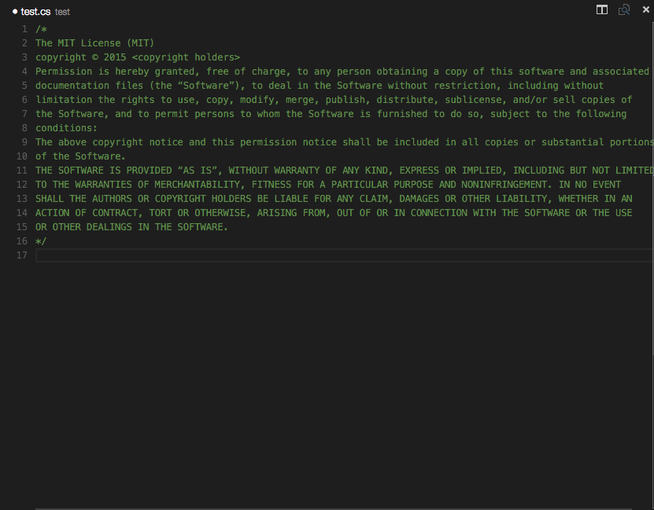

# README
### VS Code Standard-Header

This extension adds Standard-Header support to VS Code, you should know:

* Press `shift+cmd+1` to insert a standard header to your file!
* Default header is The MIT License(MIT)

####ScreenShot

** Enjoy!**
